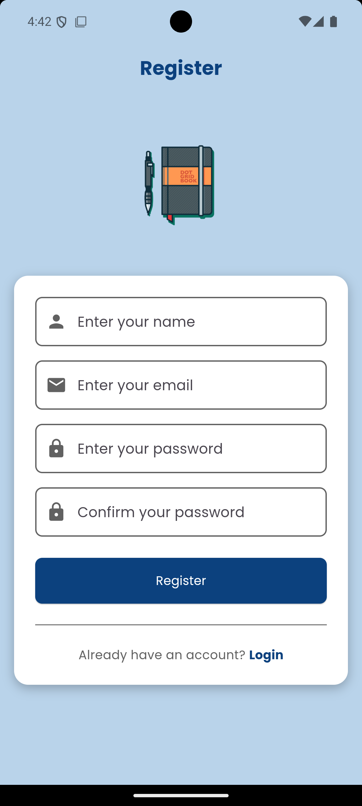
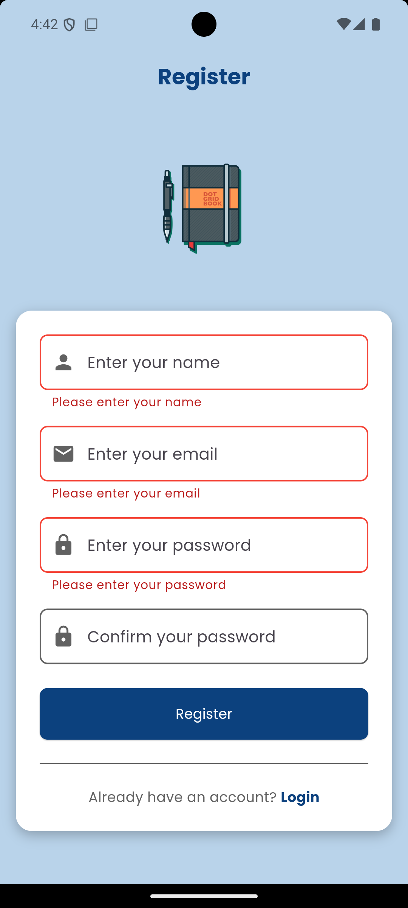
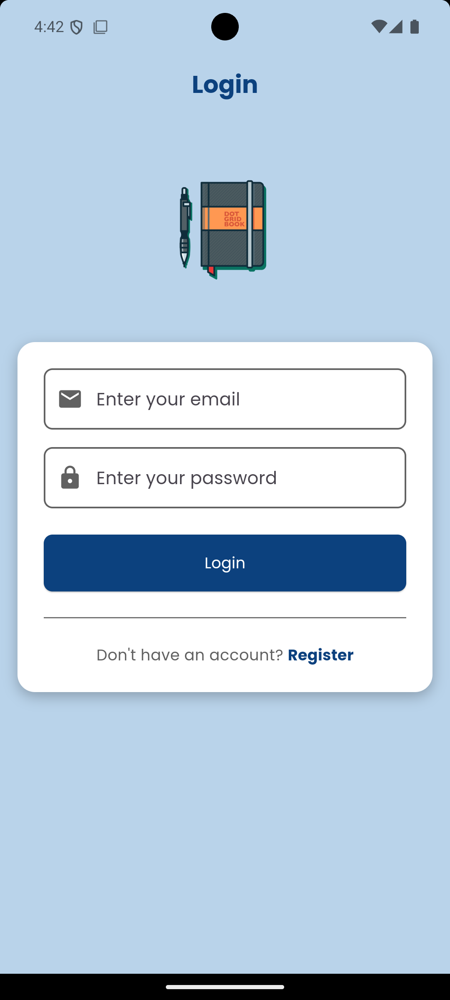
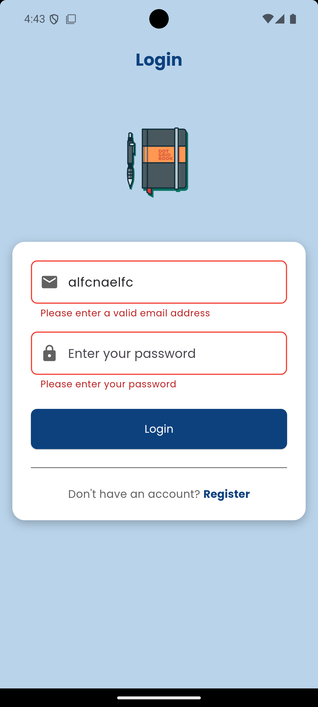
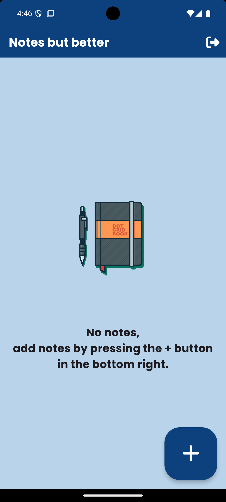
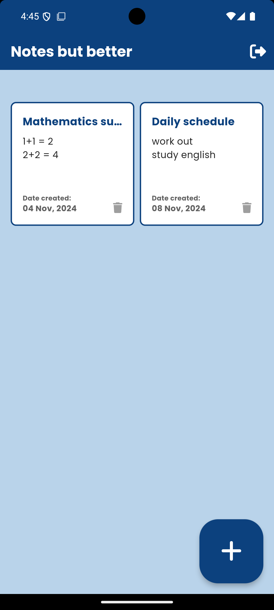
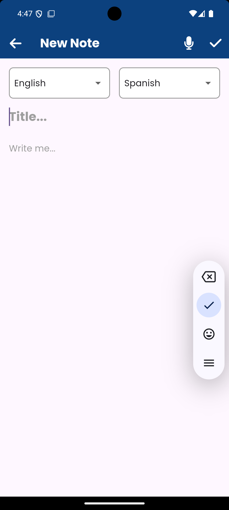
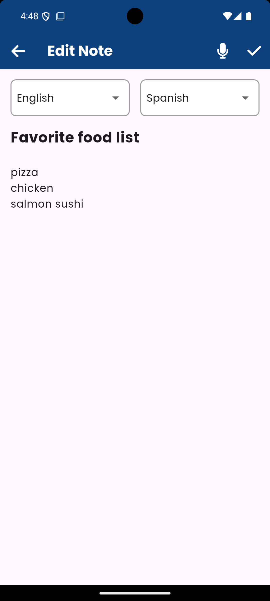
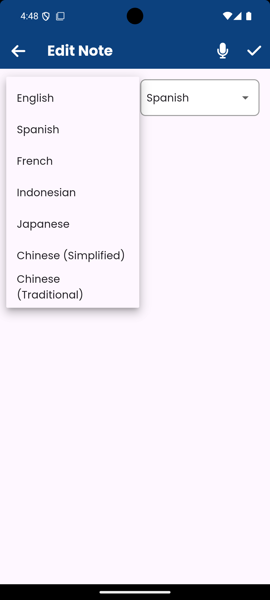
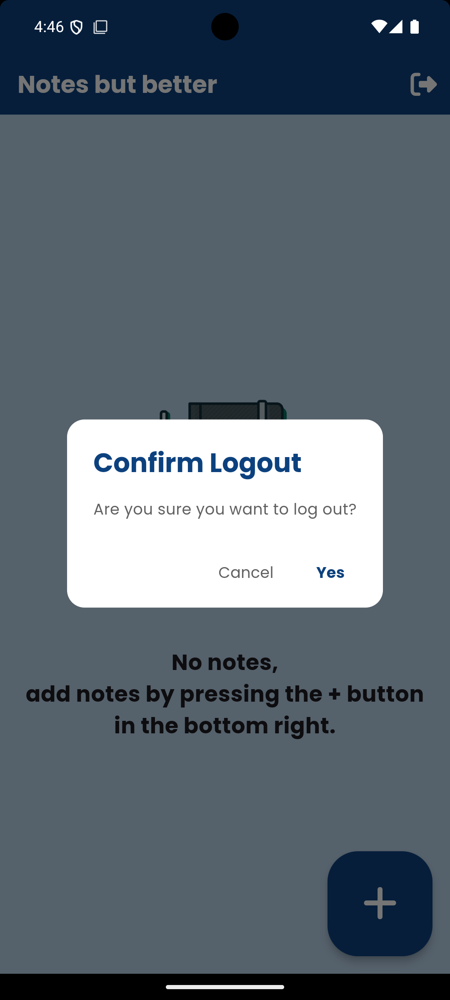

# Notes But Better

A Flutter-based mobile note-taking app with Firebase integration that allows users to create, update, and delete notes with added functionalities such as voice-to-text with language translation and authentication.

## Features
- User authentication (register and login)
- Create, update, and delete notes
- voice-to-text with language translation
- User-specific data saved in Firebase Firestore (user name)
- Simple and intuitive user interface

## Technologies Used
- **Flutter**: For building the app
- **Firebase Authentication**: For user registration and login
- **Firebase Firestore**: For saving and retrieving user notes
- **Provider**: For state management

## Screenshots

### Register Page


The register page where new users can create an account by entering their name, email, password, and confirming the password.

### Register Error


Displays validation errors if required fields are left blank or input format is incorrect.

### Login Page


The login page for existing users to access their accounts by entering their email and password.

### Login Error


Displays error messages if login credentials are incorrect or fields are left empty.

### Main Page (Empty State)


The main page when no notes are available. Encourages users to add notes using the + button.

### Main Page with Notes


Shows the main dashboard where users can view all their created notes.

### New Note


The interface for creating a new note. Users can enter a title and content for their note. Additionally, the page includes a microphone icon, allowing users to speak instead of typing. When the user taps the microphone and begins speaking, the app detects their speech, transcribes it, and translates it to the language of their choice using the integrated Google Translate API. This feature makes it easy for users to create multilingual notes quickly and efficiently.

### Edit Note


Allows users to edit the contents of an existing note.

### Translation Feature - Language Selection


The translation feature where users can select languages for translating their notes.

### Logout Confirmation


Confirmation dialog that prompts the user to confirm logout action.


## Installation
Follow these steps to set up and run the app on your local machine:

1. **Clone the repository**:
    ```bash
    git clone https://github.com/RobertGoat/note-taking-app-flutter.git
    cd note-taking-app
    ```

2. **Install dependencies**:
    ```bash
    flutter pub get
    ```

3. **Run the app**:
    ```bash
    flutter run
    ```

## License
This project is licensed under the MIT License. See the [LICENSE](LICENSE) file for details.
